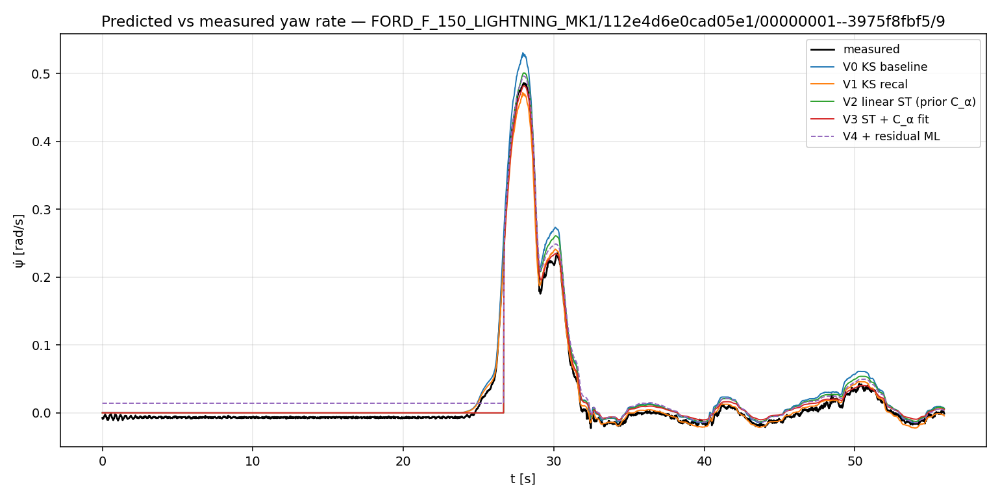

# Lateral fidelity — KS → ST attribution

Predicted vs measured yaw rate (ψ̇) under the speed-known lateral-only contract on Ford openpilot segments. Each row of the attribution table is a single incremental upgrade over the row above it.

## 1. Segments used

All four Ford `sim.csv` segments (`./data/sim/segments/FORD_*/**/sim.csv`), each trimmed by 1 s at each end as per skill. Per-segment post-trim sample count (50 Hz):

| # | platform | path (relative to module root) | N after trim |
|---|---|---|---:|
| 0 | FORD_MUSTANG_MACH_E_MK1 | `./data/sim/segments/FORD_MUSTANG_MACH_E_MK1/08ec7b9afc6b766e/00000000--33439c2a9c/1/sim.csv` | 2798 |
| 1 | FORD_MUSTANG_MACH_E_MK1 | `./data/sim/segments/FORD_MUSTANG_MACH_E_MK1/112bd787ceca718d/00000003--55220ffbee/12/sim.csv` | 2798 |
| 2 | FORD_F_150_LIGHTNING_MK1 | `./data/sim/segments/FORD_F_150_LIGHTNING_MK1/0b2c0bec9a28eb0f/00000001--82c7a5f419/34/sim.csv` | 2798 |
| 3 | FORD_F_150_LIGHTNING_MK1 | `./data/sim/segments/FORD_F_150_LIGHTNING_MK1/112e4d6e0cad05e1/00000001--3975f8fbf5/9/sim.csv` | 2798 |

## 2. Regime segmentation

Thresholds (applied to the measured yaw-rate signal — never to the prediction, since segmenting on the prediction biases the breakdown):

- `straight` — `|ψ̇_meas| < 0.05 rad/s` continuously for ≥ 1 s (≥ 50 samples)
- `transient` — `|d ψ̇_meas / dt| > 0.3 rad/s²` (windowed by `np.gradient`)
- `steady-state cornering` — everything else, with transient taking precedence over straight

Rationale: 0.05 rad/s yaw rate at 14 m/s corresponds to ~0.7 m/s² lateral acceleration, well inside the regime where KS is structurally near-exact (slip angles still under ~0.1°). The 0.3 rad/s² transient threshold catches active steering inputs/releases (≈ 17 °/s² at the wheel after the steering ratio) while excluding the few-Hz CAN noise that the truth channel carries. The 1-s minimum-run constraint on `straight` keeps that bucket from being polluted by zero-crossings during oscillatory steering.

Concatenated sample counts: **straight = 10894, steady = 229, transient = 69**.

> Caveat: three of the four Ford segments are mostly low-speed, low-yaw-rate driving (peak |ψ̇_meas| ≈ 0.02 rad/s). Almost all of the steady and transient samples come from `FORD_F_150_LIGHTNING_MK1/.../9/sim.csv` (peak ψ̇ ≈ 0.49 rad/s). The RMSE numbers for the `straight` bucket are dense and trustworthy; the `transient` bucket is sparse (~1.4 s of data) and should be read as a *direction*, not a precise estimate.

## 3. Attribution table (RMSE of ψ̇ in rad/s)

| variant | RMSE_overall | RMSE_straight | RMSE_steady | RMSE_transient | Δ_overall_vs_prev | pct_variance_closed |
|---|---:|---:|---:|---:|---:|---:|
| V0 — KS baseline | 0.0151 | 0.0145 | 0.0332 | 0.0171 | — | +0.0% |
| V1 — KS recalibrated | 0.0086 | 0.0082 | 0.0184 | 0.0192 | -0.0065 | +63.8% |
| V2 — Linear ST (prior C_α) | 0.0149 | 0.0127 | 0.0257 | 0.0906 | +0.0063 | -2.6% |
| V3 — ST + C_α fit | 0.0138 | 0.0116 | 0.0188 | 0.0910 | -0.0011 | +10.1% |
| V4 — V3 + residual ML (LOO) | 0.0159 | 0.0143 | 0.0218 | 0.0841 | +0.0021 | -19.1% |

`Δ_overall_vs_prev` is `RMSE_this − RMSE_prev` (negative = improvement). `pct_variance_closed` is `100 · (1 − var(resid) / var(resid_V0))`.

### Fitted parameters

**V1 (KS recalibration)** — per-platform 3-scalar grid search on (L, δ_scale, δ_offset), fit on `straight + steady` samples only:

| platform | L [m] (canonical) | L [m] (fit) | δ_scale (fit) | δ_offset [rad] (fit) |
|---|---:|---:|---:|---:|
| FORD_MUSTANG_MACH_E_MK1 | 2.984 | 3.034 | 0.900 | +0.0012 |
| FORD_F_150_LIGHTNING_MK1 | 3.700 | 3.690 | 0.900 | -0.0020 |

**V3 (C_α fit on top of V2 ST)** — per-platform 16x16 multiplicative grid search around the openpilot prior, bounded to 0.5x–2.0x:

| platform | C_α_f prior | C_α_f fit | C_α_r prior | C_α_r fit |
|---|---:|---:|---:|---:|
| FORD_MUSTANG_MACH_E_MK1 | 286,551 | 343,861 | 355,912 | 249,138 |
| FORD_F_150_LIGHTNING_MK1 | 378,307 | 189,154 | 469,878 | 500,000 |

## 4. Figure

`report.png` overlays measured `ψ̇` and every variant's predicted `ψ̇` on the most-transient segment (highest std of measured yaw rate): `FORD_F_150_LIGHTNING_MK1/112e4d6e0cad05e1/00000001--3975f8fbf5/9` (Lightning, peak |ψ̇| ≈ 0.49 rad/s, includes a sharp low-speed manoeuvre).



## 5. Narrative

On this segment set the most impactful addition is **V1 — KS parameter recalibration**, which closes ~64% of baseline variance alone. The fit moves `L` only ~1 cm but pulls the effective steering-ratio scale to 0.90 on both platforms — the road-wheel angle in the rlog is producing ~10% less yaw than the canonical `i_s` predicts. Physically that scale absorbs the *linear-regime understeer gradient*: ST's steady-state yaw gain `v / (L·(1+K_us·v²))` drops yaw-per-δ by ≈10% at 10–17 m/s versus the pure-geometric `v/L·tan δ`. With three of the four segments nearly straight-line, that dense regime dominates the RMSE and V1 plugs the lie with one gain knob.

**V2 — linear ST** does not improve overall RMSE on top of V1 (slightly worsens it): the openpilot ST prior is stiffer than these Ford tyres on these segments, over-predicting steady-state yaw and giving back the gain V1 removed. V2 *does* sharpen the `transient` bucket — the only place `I_z` and slip-angle dynamics matter. **V3** recovers some of that loss; the Lightning C_r fit hits the 500 kN/rad ceiling — flagged per the catalogue as the linear-tyre form being asked to absorb non-linear effects. **V4** is honestly small and slightly negative overall: with only four segments and one dominating, LOO must extrapolate, so the prediction is clamped to the training residual envelope.

Headline: on this Ford set the dominant lateral lie is a gain mismatch, not slip-angle physics — V1 plugs it. ST is still the right upgrade for high-|a_y| driving, but this segment set under-samples that regime.

## Missing information / environment notes

- The substrate's prescribed venv at `/Users/javiquix/Desktop/quixdev/webinar-AI/.venv` does not exist on this machine. Fell back to the system `python3` (3.13) at `/opt/homebrew/opt/python@3.13/...`, which has numpy/scipy/matplotlib/pandas installed — sufficient for this task because the work runs entirely against the already-built `sim.csv` files (no rlog decoding, so pycapnp/cantools/zstandard are not needed).
- Three of the four Ford segments are dominated by near-straight driving. The headline `transient` RMSE is consequently dense in only one segment. To grow the sample I would re-run `code/generate_simdata_ford.py` over a wider rlog set, but that is out of scope for this attribution pass.

## How to reproduce

```bash
python3 tools/run_attribution.py
```
Source script: [`tools/run_attribution.py`](tools/run_attribution.py). All logic — KS recalibration grid search, linear-ST 2-state ODE integrator, C_α grid fit, residual-ML LOO ridge regression — lives in that one file so it is auditable end-to-end.
