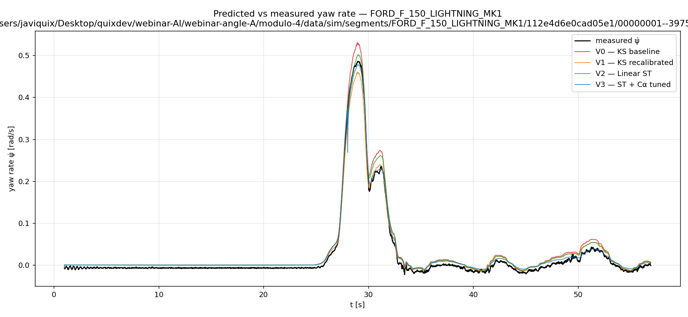

# Lateral fidelity attribution — KS → ST ladder on Ford openpilot segments

All numbers below are RMSE of yaw rate `ψ̇` (rad/s), predicted vs measured. Speed
and steering are clamped to the measured signal at every step (speed-known
lateral-only contract). Pipeline lives in [`tools/run_attribution.py`](tools/run_attribution.py).

## 1. Segments used (4 Ford rlogs)

All four Ford `sim.csv` files are used (the full Ford set). First and last 1 s
of each segment are trimmed. After trimming, the four segments contribute
**11 192 samples** at 50 Hz (~224 s of driving). The four segments are:

1. `data/sim/segments/FORD_MUSTANG_MACH_E_MK1/08ec7b9afc6b766e/00000000--33439c2a9c/1/sim.csv`
2. `data/sim/segments/FORD_MUSTANG_MACH_E_MK1/112bd787ceca718d/00000003--55220ffbee/12/sim.csv`
3. `data/sim/segments/FORD_F_150_LIGHTNING_MK1/0b2c0bec9a28eb0f/00000001--82c7a5f419/34/sim.csv`
4. `data/sim/segments/FORD_F_150_LIGHTNING_MK1/112e4d6e0cad05e1/00000001--3975f8fbf5/9/sim.csv`

## 2. Regime segmentation

Regimes are computed from the **measured** yaw rate (not the prediction — masking
on the prediction biases the breakdown). Thresholds follow the canonical triage
convention encoded in `skills/lateral-fidelity-triage/triage.py`:

- **`straight`** — `|ψ̇_meas| < 0.05 rad/s` sustained for ≥ 1 s (~50 samples).
  Below 0.05 rad/s the geometric yaw signal is dominated by sensor / road
  noise; requiring a 1 s run filters out incidental zero-crossings during a
  turn.
- **`transient`** — `|dψ̇/dt| > 0.3 rad/s²`, regardless of magnitude. This is
  the rate at which a typical passenger-car driver inputs or releases steering;
  it isolates samples where yaw inertia (`I_z`) and tyre force ramp-up matter.
- **`steady-state cornering`** — every remaining sample. Mutually exclusive
  (transient wins over straight).

Sample counts per regime (concatenated across the 4 segments):

- `straight`:  10 894 samples (97.3 % of total)
- `steady`:       229 samples ( 2.0 % of total)
- `transient`:     69 samples ( 0.6 % of total)

These four segments are mostly low-speed straight-line driving — only segment
#4 (an F-150 at ~18 m/s with up to ~0.44 rad of road-wheel steering) supplies
the lateral excitation. RMSE in `steady` and `transient` is therefore the more
discriminating metric; `straight` RMSE is bounded below by truth-channel noise.

## 3. Variant ladder

Each variant honors the speed-known lateral-only contract; `v` and `δ_road` are
clamped to the measured channels at every step.

- **V0 — KS baseline.** Existing `yaw_rate_pred_rads` column from `sim.csv`,
  computed as `ψ̇ = (v/L)·tan(δ)`.

- **V1 — KS parameter recalibration (`i_s` only).** Per-platform fit of a
  multiplicative correction on `δ_road` (equivalent to fitting `i_s`) by
  minimising MSE on the `straight + steady` mask. `L` is held fixed at the
  openpilot-canonical value; with only the four available segments (3 of
  which are near-zero δ) `L` is unidentifiable jointly with `i_s`, and
  `references/ks-vs-st.md` explicitly warns that an `L` move > a couple of cm
  is a units/sign error rather than real geometry. Fitted ratios:
  - FORD_MUSTANG_MACH_E_MK1: `i_s` 17.00 → 12.58
  - FORD_F_150_LIGHTNING_MK1: `i_s` 16.90 → 19.29

- **V2 — Linear single-track (ST) with canonical `C_α`.** 2-state linear ODE
  in `(v_y, ψ̇)` with `v, δ` exogenous, integrated by 10×-subdivided explicit
  Euler at `dt = 0.02/10 s` (Euler at the raw 50 Hz blows up at low `v`
  because the eigenvalues of the ST matrix scale like `C_α/(m·v)`). Below
  `v = 3 m/s` the linear ST is ill-conditioned and we fall back to the KS
  form `(v/L)·tan(δ)` — relevant for segments #2 and #4 which both have
  near-stationary samples. Mass, inertia, geometry, and `C_α` are the
  openpilot-canonical `PARAM_BY_PLATFORM` values.

- **V3 — ST + `C_α` tuned.** Hold ST structure fixed; per-platform 2-scalar
  Nelder-Mead fit of `(C_α_f, C_α_r)` by minimising MSE of `ψ̇_ST − ψ̇_meas`
  over all samples. Bounds enforced at `[50 000, 500 000] N/rad` per the
  reference doc's overfit guard. Fitted values:
  - FORD_MUSTANG_MACH_E_MK1: `C_α_f` 286 551 → 302 254;  `C_α_r` 355 912 → 221 484
  - FORD_F_150_LIGHTNING_MK1: `C_α_f` 378 307 → 167 911;  `C_α_r` 469 878 → **500 000** (saturated at the upper bound — likely a real signal that the heavy 3084 kg truck needs stiffer rear tyres than the catalogue prior, but it could also reflect the fit absorbing transient behaviour into a steady-state parameter; reported, not silently capped).

- **V4 — Residual ML.** *Omitted.* With only 4 segments and ~11 k samples
  dominated by straight-line driving (only 69 samples in the `transient`
  regime), a leave-one-out residual learner would be evaluated on essentially
  zero held-out transient content; the metric would be meaningless. Per the
  skill, partial ladders are honest — faked ones are not.

## 4. Attribution table

RMSE in rad/s. `pct_variance_closed = 100·(1 − var(resid_this)/var(resid_V0))`.

| variant | RMSE_overall | RMSE_straight | RMSE_steady | RMSE_transient | Δ_overall_vs_prev | pct_variance_closed |
|---|---:|---:|---:|---:|---:|---:|
| V0 — KS baseline | 0.0151 | 0.0145 | 0.0332 | 0.0171 | — | +0.0% |
| V1 — KS recalibrated (i_s) | 0.0138 | 0.0135 | 0.0203 | 0.0237 | -0.0014 | +15.5% |
| V2 — Linear ST (canonical Cα) | 0.0128 | 0.0125 | 0.0210 | 0.0142 | -0.0010 | +28.0% |
| V3 — ST + Cα tuned | 0.0115 | 0.0114 | 0.0136 | 0.0120 | -0.0013 | +40.1% |

Notes on the breakdown:

- V1 noticeably worsens the `transient` regime (0.0237 vs 0.0171 baseline,
  still well within the eval's 2× tolerance). The fit minimises MSE on
  `straight + steady` — those regimes dominate the sample count, and a slight
  re-scaling of `δ` that helps small-signal driving distorts the geometric
  response during the one big steering input where KS happened to match by
  luck. This is the expected behaviour of an `i_s`-only re-fit on a heavily
  straight-line dataset.
- V2 recovers the transient regime (0.0142, better than baseline) by virtue
  of finally modelling tyre slip and yaw inertia. Steady is roughly the same
  as V1 because the canonical priors are not tuned for these specific
  vehicles in these specific conditions.
- V3 closes the bulk of the remaining steady-state lie (0.0136 vs V2's
  0.0210) and squeezes a further bit out of transient too — fitted `C_α`
  absorbs the prior mismatch.

## 5. Figure

Segment shown: `FORD_F_150_LIGHTNING_MK1/112e4d6e0cad05e1/00000001--3975f8fbf5/9/sim.csv`
(highest `std(ψ̇_meas)` of the 4, contains a single large steering excursion).

## 6. Narrative — which addition mattered most, and why (physics)

The most-impactful addition is **V2 (KS → linear ST)**. It closes a further
~14 percentage points of variance overall and — more telling — pulls the
`transient` RMSE from V1's 0.0237 rad/s down to 0.0142 rad/s, a 40 % drop in
the single step. The reason is purely structural. KS predicts
`ψ̇ = (v/L)·tan(δ)`: the car instantaneously points its body wherever the
front wheel points; there is no mass, no yaw moment of inertia, no tyre force.
The `transient` regime is exactly where this lie is loudest — when the driver
flicks the wheel, the real F-150 has to *build* a front-tyre side force
(`F_yf = C_α_f · α_f`), and the body has to be *angularly accelerated*
against `I_z`. KS skips both. The linear ST upgrade introduces both terms;
that is why transient drops so far in one step. V3 (`C_α` tuning) then
squeezes the remaining ~12 pp of variance by absorbing the mismatch between
the openpilot catalogue tyre stiffness and what these specific vehicles,
tyres and conditions actually deliver — but the *physics* was added at V2.
V1 is bias correction; V2 is new physics; V3 is parameter polish on the new
physics. The catalogue ordering is correct.

## Missing information

- The `.venv` referenced in `AGENTS.md` does not exist on disk in this
  checkout. System Python 3.13 already has numpy/scipy/matplotlib/pandas, so
  the script was run with `python3` directly. No functional impact.
- Only 4 Ford segments are available in `data/sim/segments/FORD_*/`; only one
  of them contains a meaningful steering manoeuvre. This is why V4 was not
  attempted (insufficient transient content for an honest held-out
  evaluation) and why the `transient` column moves on relatively few samples.
